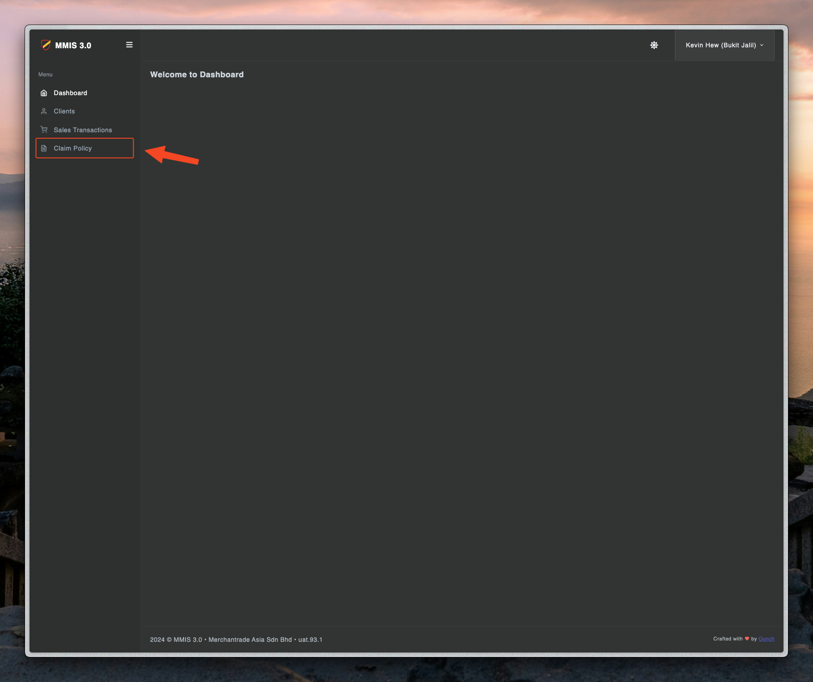
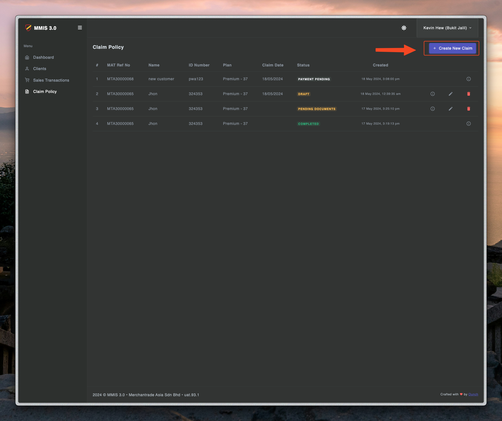
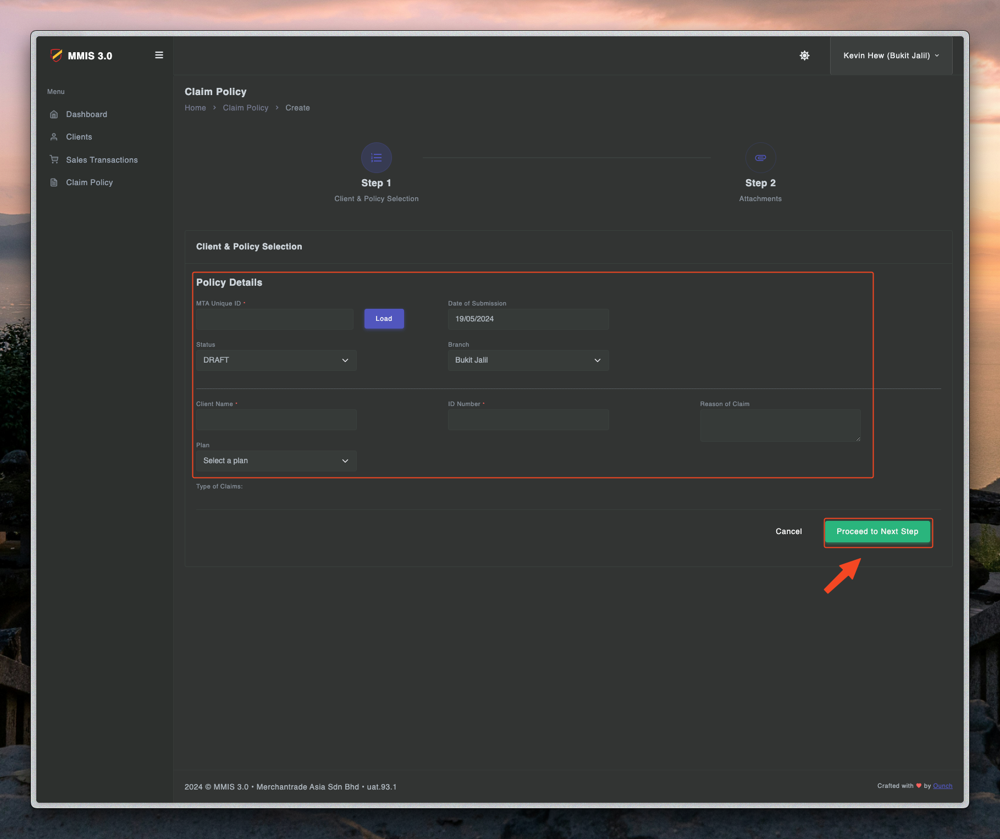
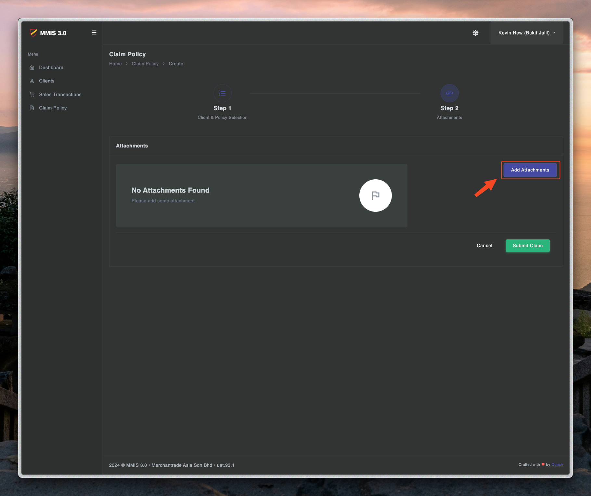
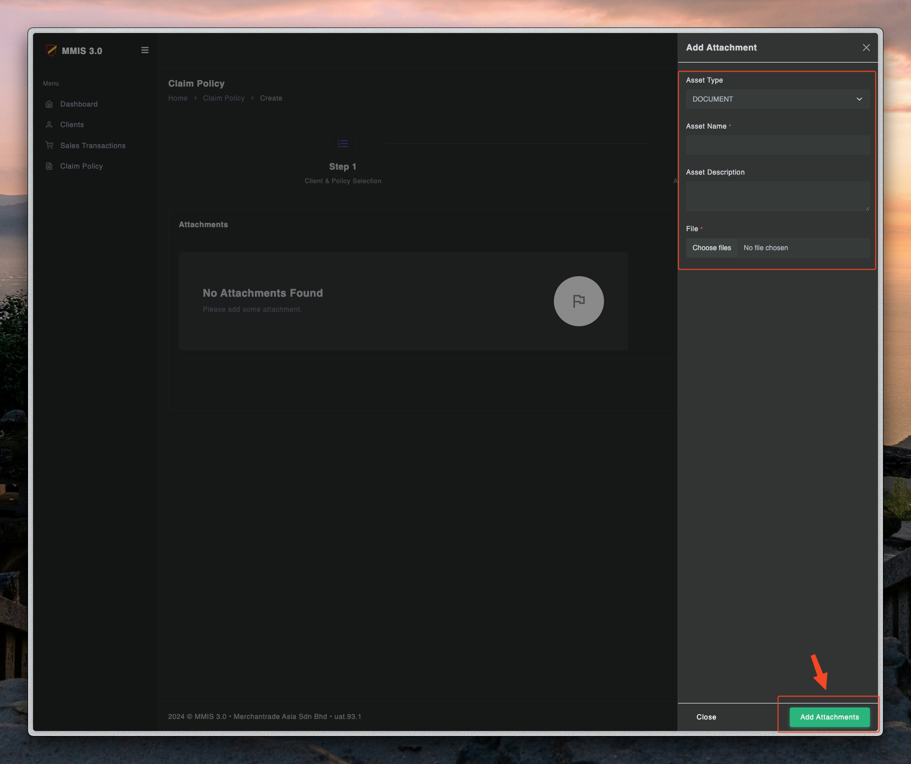
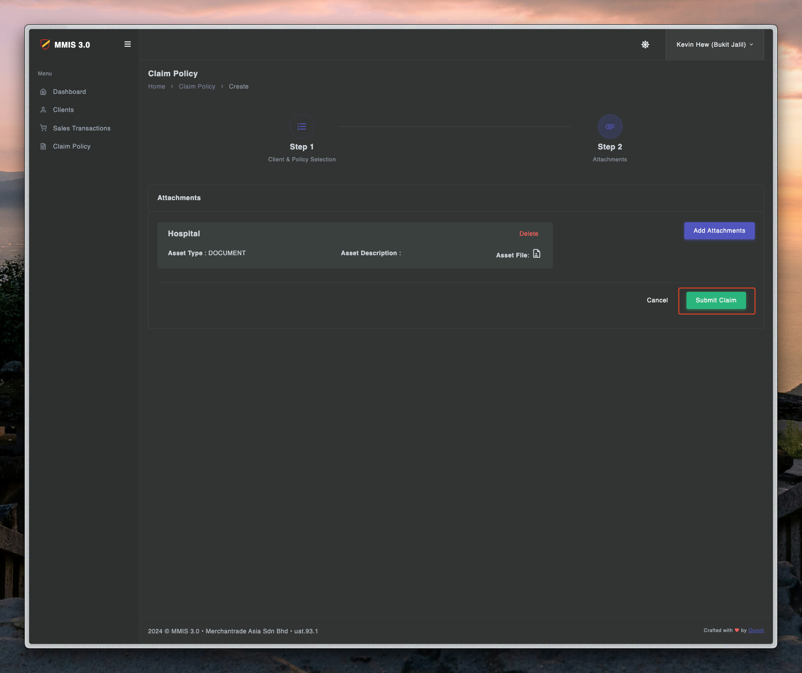

# Claim process - Step one

---

## Apply claim at teller

1. First you need to login to teller.mmis.ounch.com with your username and password.

2. Click claim to navigate into the page.

3. Click create claim to create a new claim.

4. Fill in the details of claim and proceed to the next step.

5. Fill in the identity details and submit.

