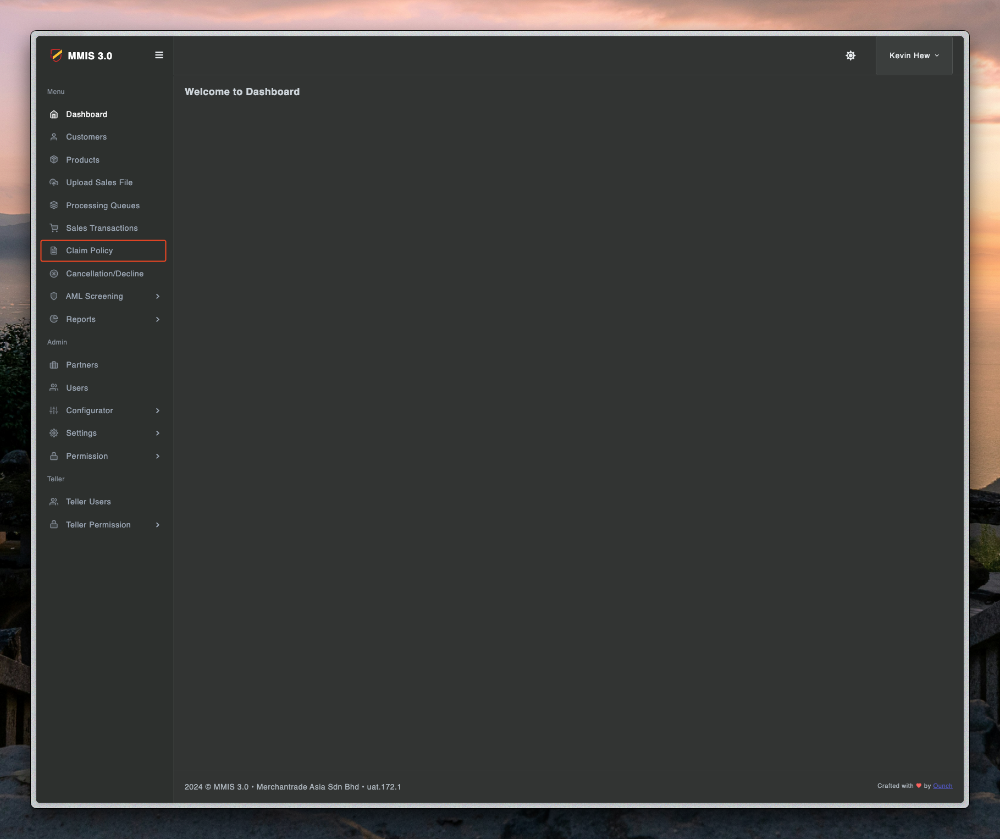
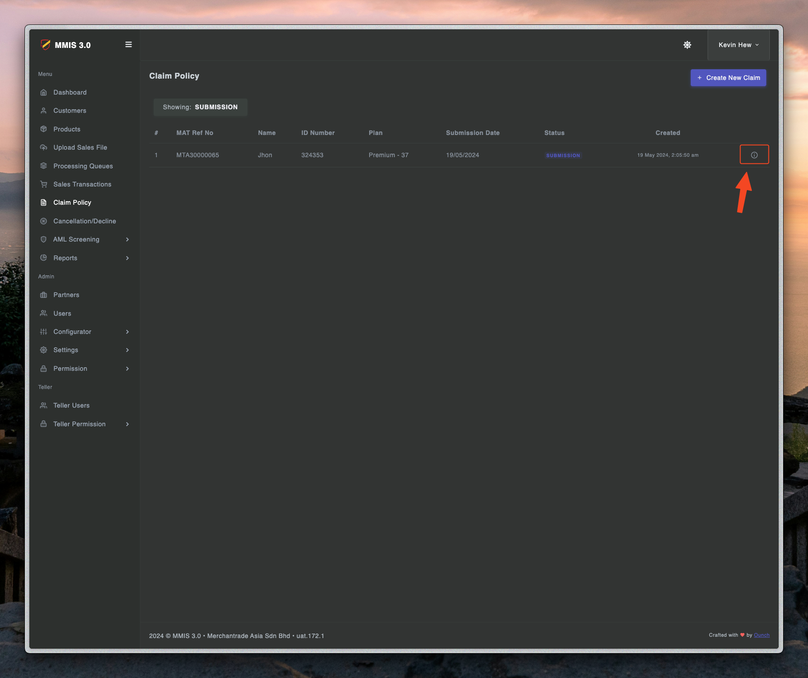
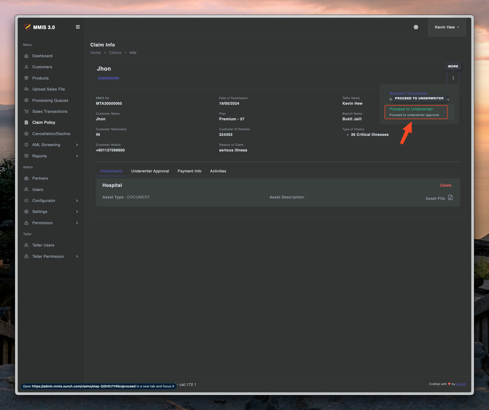
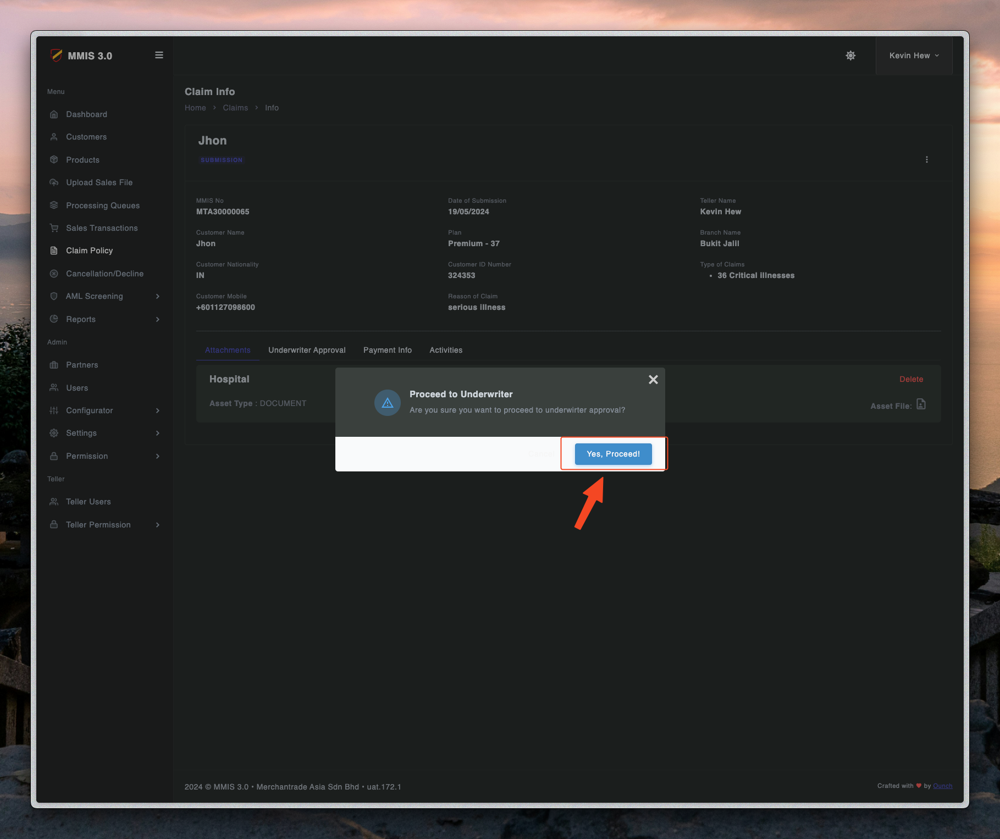
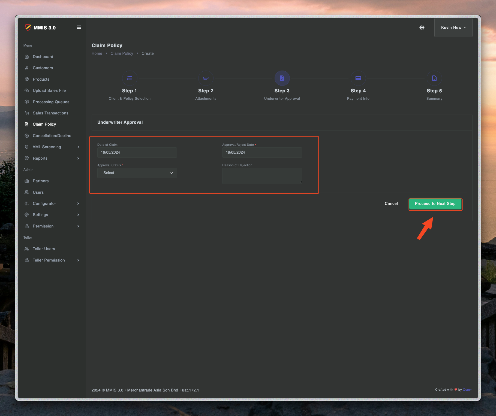
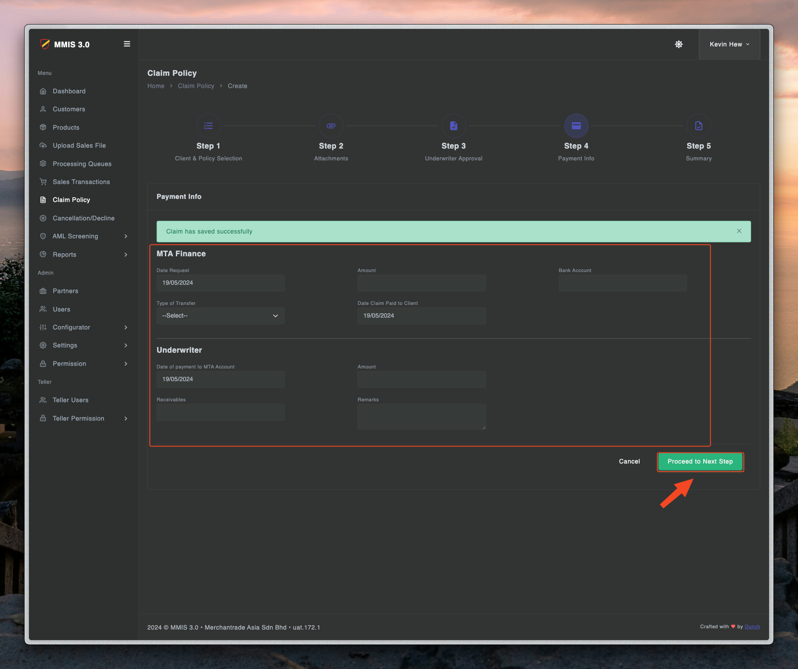
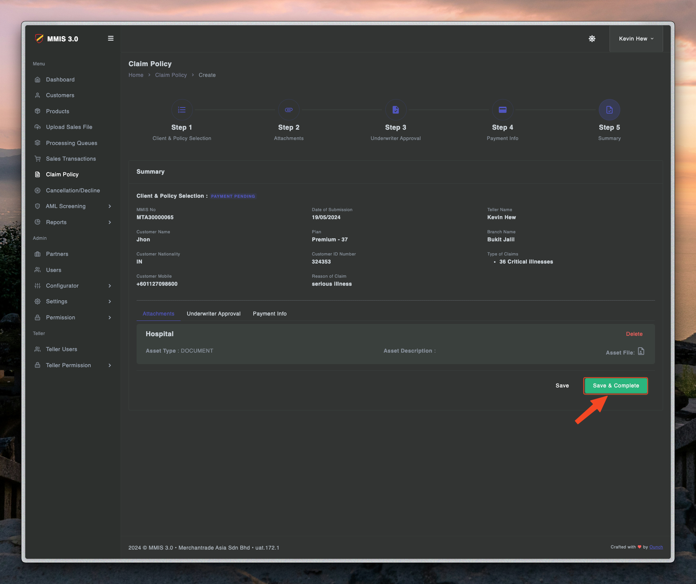
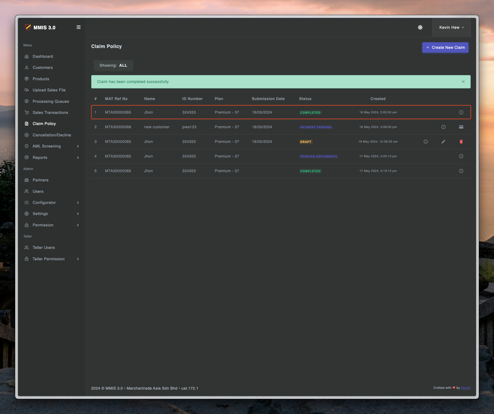

# Claim process - Step two

---

## Approve claim at admin

1. First you need to login to admin.mmis.ounch.com with your username and password.

2. Click claim to navigate into the page.

2. Click info to navigate into the page.

3. Click info and approve the claim.

4. Key in details for underwriter approval.

5. Key in details for payment.

6. Check the details and save to complete the claim.

