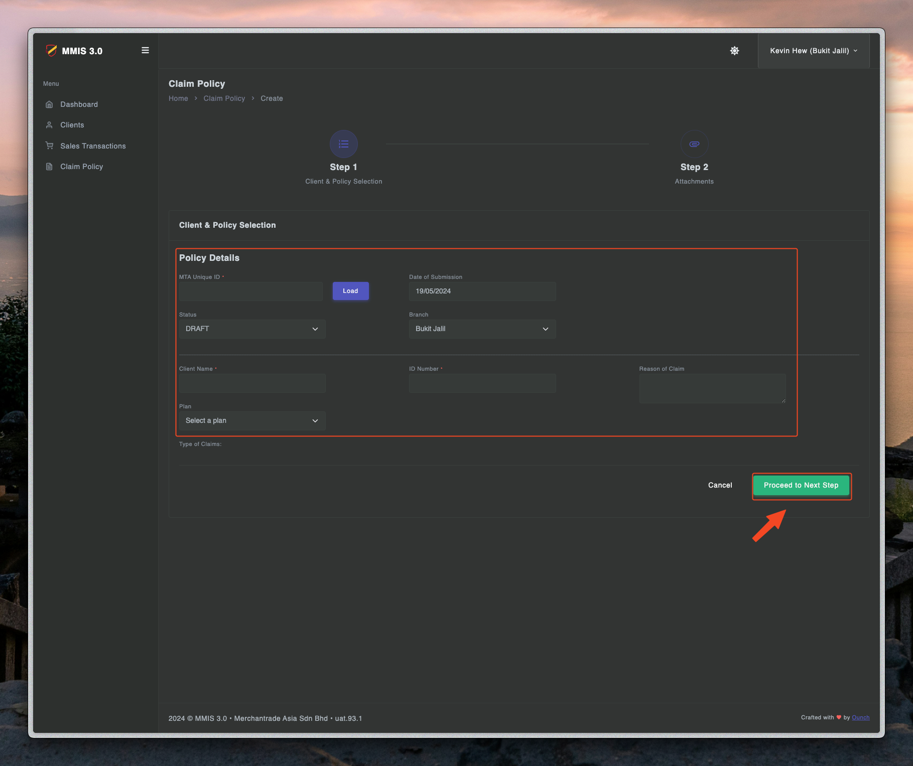
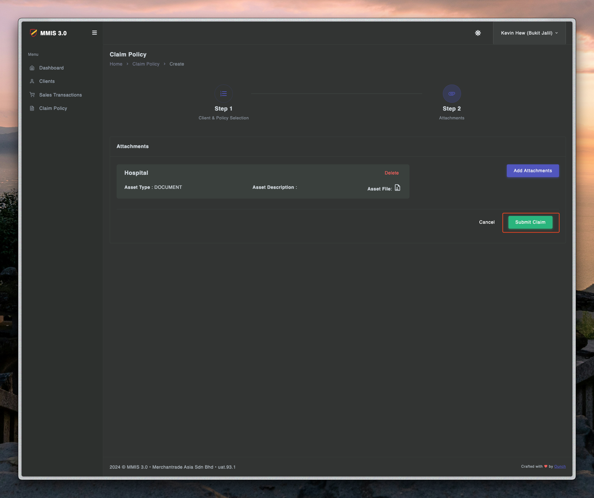

# Apply claim

## Apply claim at teller

---

1. First you need to login to teller.mmis.ounch.com with your username and password.

2. Click claim to navigate into the page.

3. Click create claim to create a new claim.

4. Fill in the details of claim and proceed to the next step.

5. Fill in the identity details and submit.

## Apply claim at admin

---

1. First you need to login to admin.mmis.ounch.com with your username and password.

2. Click **Create New Claim** to navigate into the page.

3. **Step 1** - fill up all the required fields then click on **Proceed to Next Step**.
    - MTA Unique ID*
    - Client Name*
    - ID Number*

3. **Step 2** - process:
    - Click on **Add Attachments**
    - Fill up the **required fields** & **upload file**
    - Click on **Add Attachment** button

4. **Step 3** - fill up all the required fields then click on **Proceed to Next Step** OR **Save & Exit**.

5. **Step 4** - fill up all the required fields then click on **Proceed to Next Step** OR **Save & Exit**.
    - Date Request
    - Type of Transfer
    - Amount
    - Date Claim Paid to Client
    - Bank Account
    - Bank Name

6. **Step 5** - fill up all the required fields then click on **Proceed to Next Step** OR **Save & Exit**.
    - Date of payment to MTA Account
    - Receivables
    - Amount
    - Remarks

7. Check the details and **save to complete** the claim.

