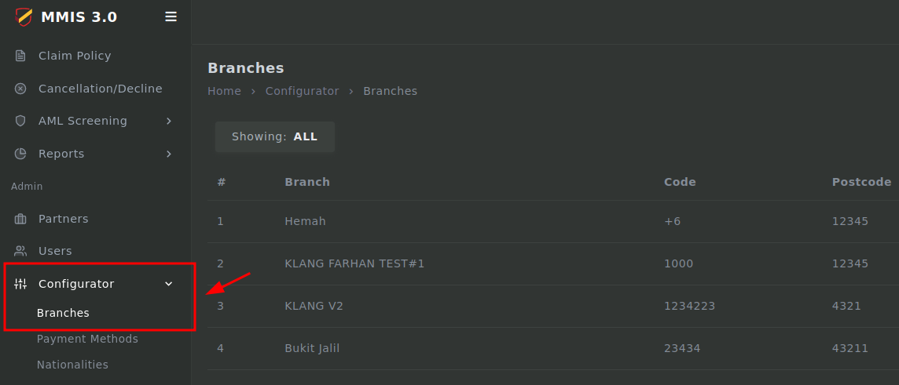
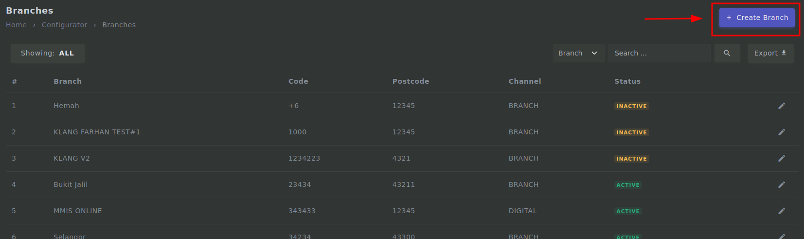
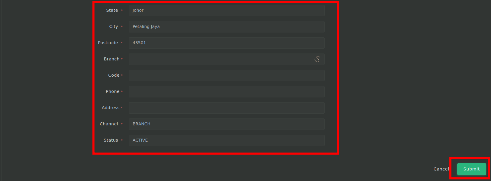

# Branches process

---

## Login

1. First you need to login to <mark>admin.mmis.ounch.com</mark> with your username and password.

2. Click on the **Branches** link from the sidebar under **Configurator** to navigate into the page. 

3. Then click on **Create Branch** to create a new branch.

4. Fill in the required fields then click on **Submit**.
- State  is required
- City  is required
- Postcode  is required
- Branch is required
- Code is required
- Phone is required
- Address is required
- Channel  is required
- Status  is required

