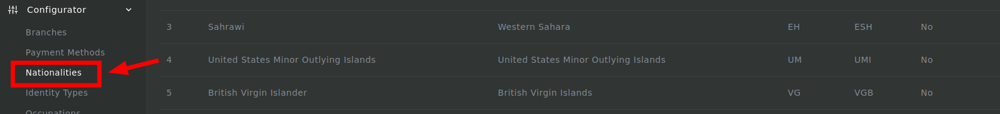
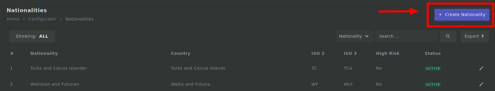
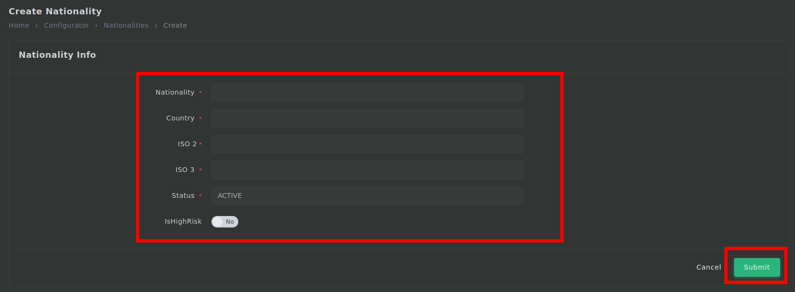

# Nationalities process

## Login

---

1. First you need to login to <mark>admin.mmis.ounch.com</mark> with your username and password.

2. Click on the **Nationalities** link from the sidebar to navigate into the page. 

3. Then click on **Create Nationality** to create a new nationality.

4. Fill in the required fields then click on **Submit**.
- Nationality  is required
- Country  is required
- ISO 2 is required
- ISO 3  is required
- Status  is required

