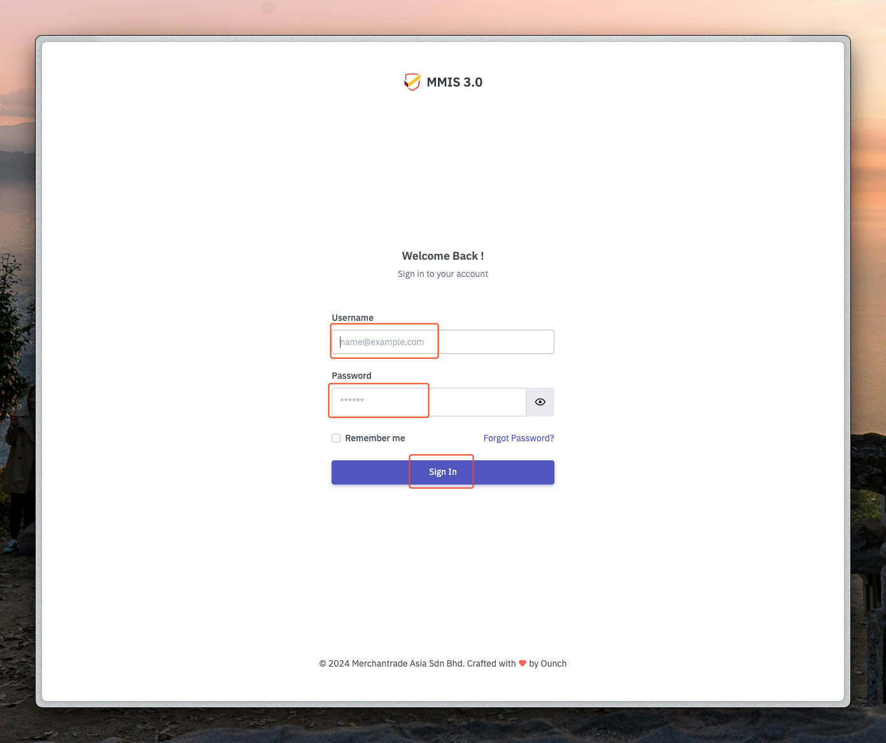
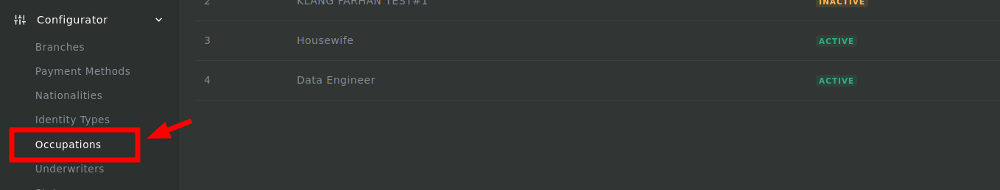
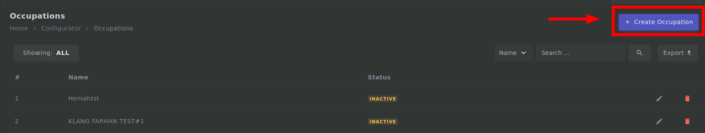
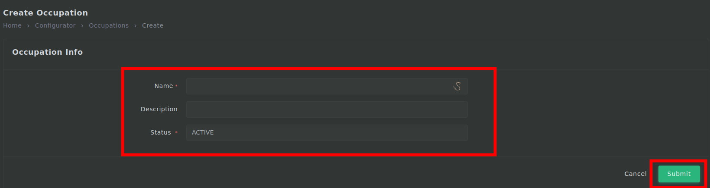

# Occupations process

---

# Login

1. First you need to login to <mark>admin.mmis.ounch.com</mark> with your username and password.

2. Click on the **Occupations** link from the sidebar to navigate into the page. 

3. Then click on **Create Occupation** to create a new occupation.

4. Fill in the required fields then click on **Submit**.
- Name is required
- Status is required

