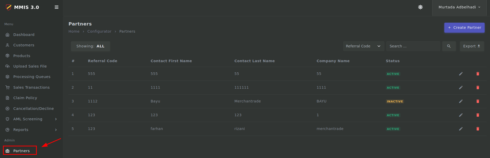
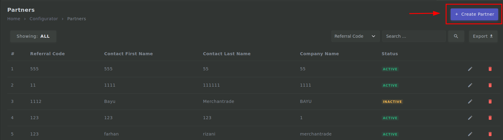
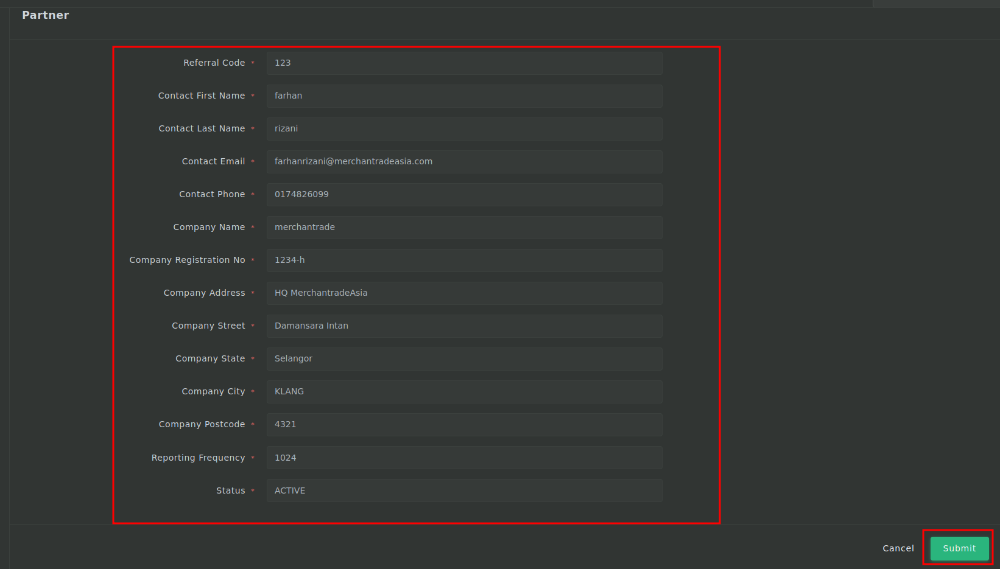

# Partner process

## Login

---

1. First you need to login to <mark>admin.mmis.ounch.com</mark> with your username and password.

2. Click on the **Partners** link from the sidebar to navigate into the page. 

3. Then click on **Create Partner** to create a new partner.

4. Fill in the required fields then click on **Submit**.
- Referral Code is required
- Contact First Name is required
- Contact Last Name is required
- Contact Email is required
- Contact Phone is required
- Company Name is required
- Company Registration No is required
- Company Address is required
- Company Street is required
- Company State is required
- Company City is required
- Company Postcode is required
- Reporting Frequency is required
- Status is required

