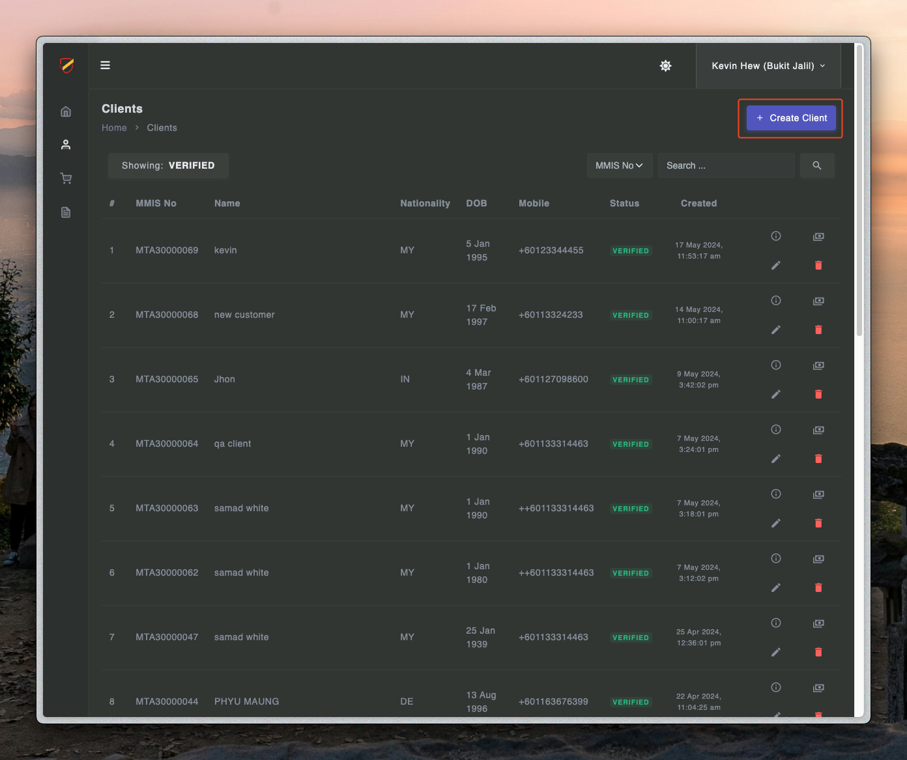
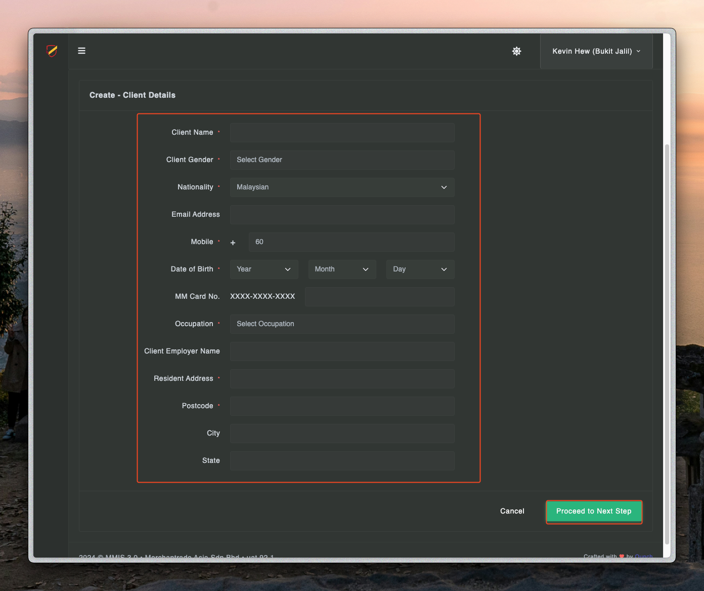
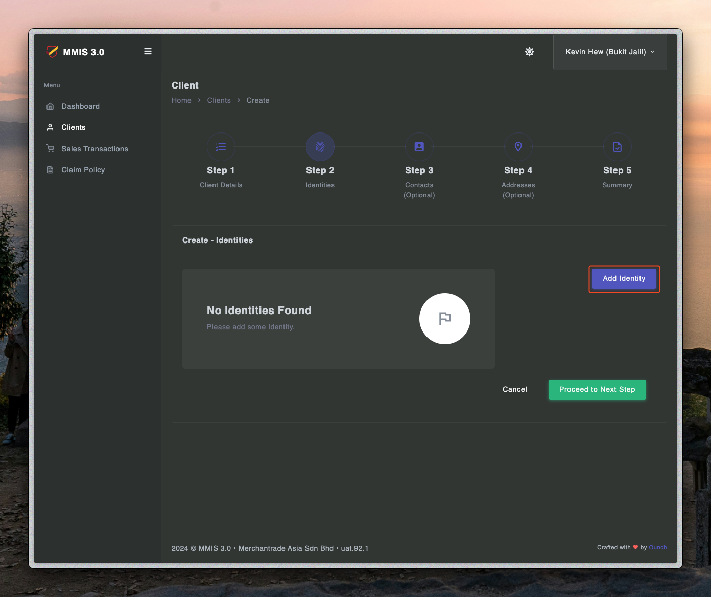
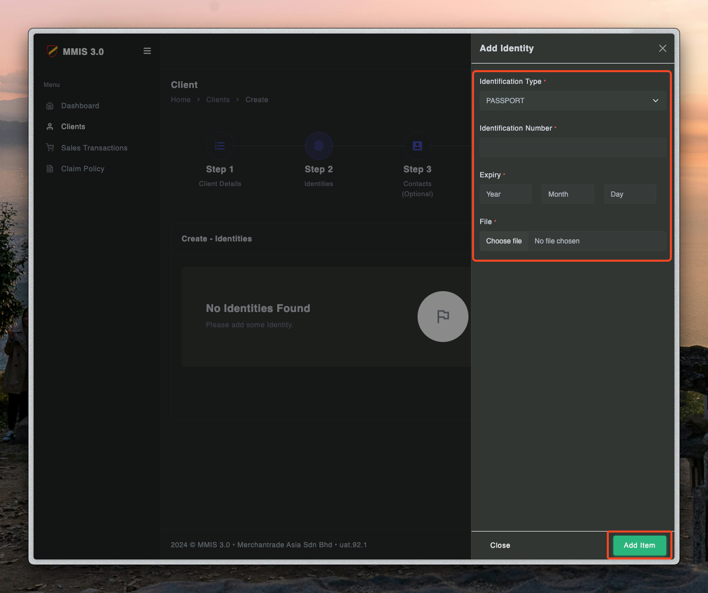
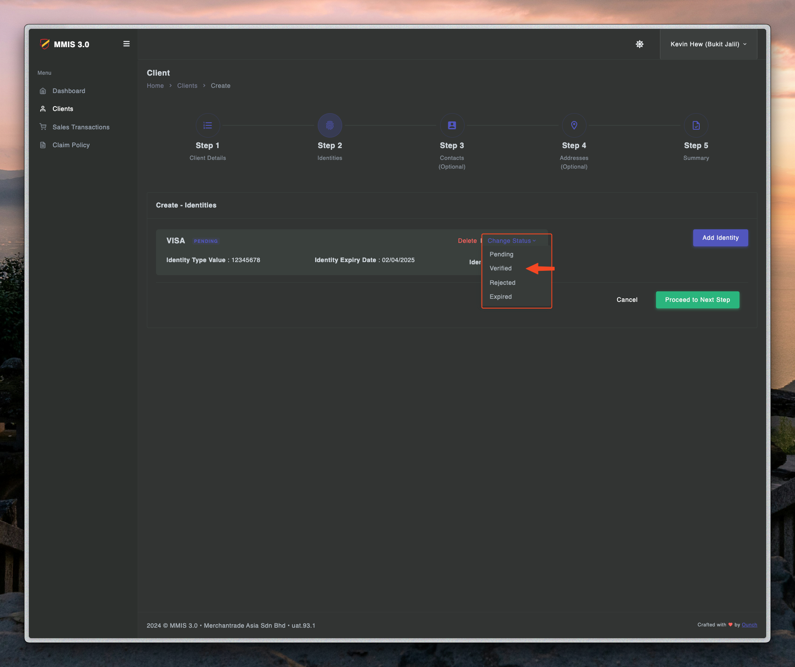
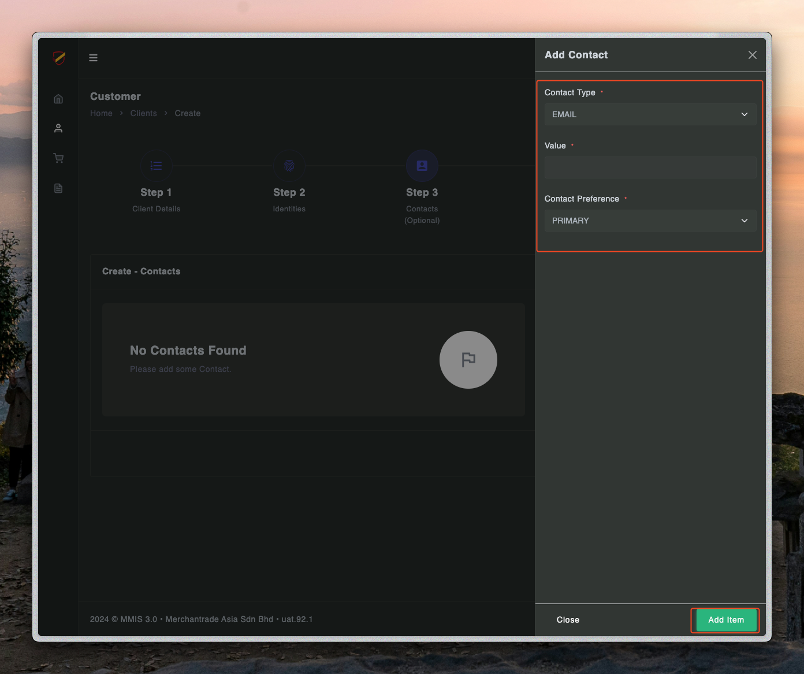
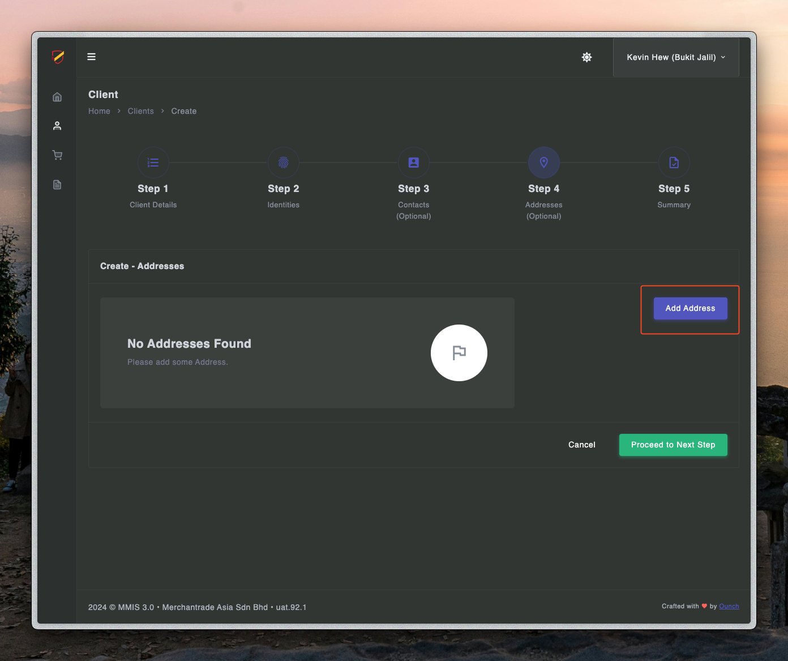
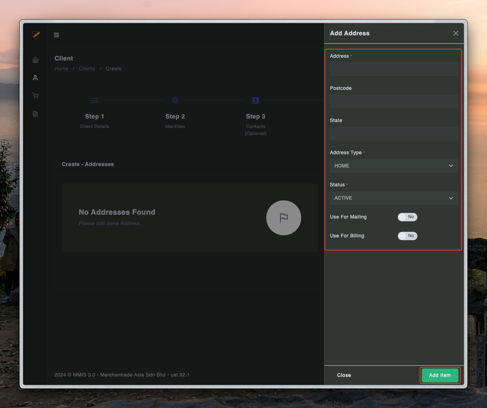
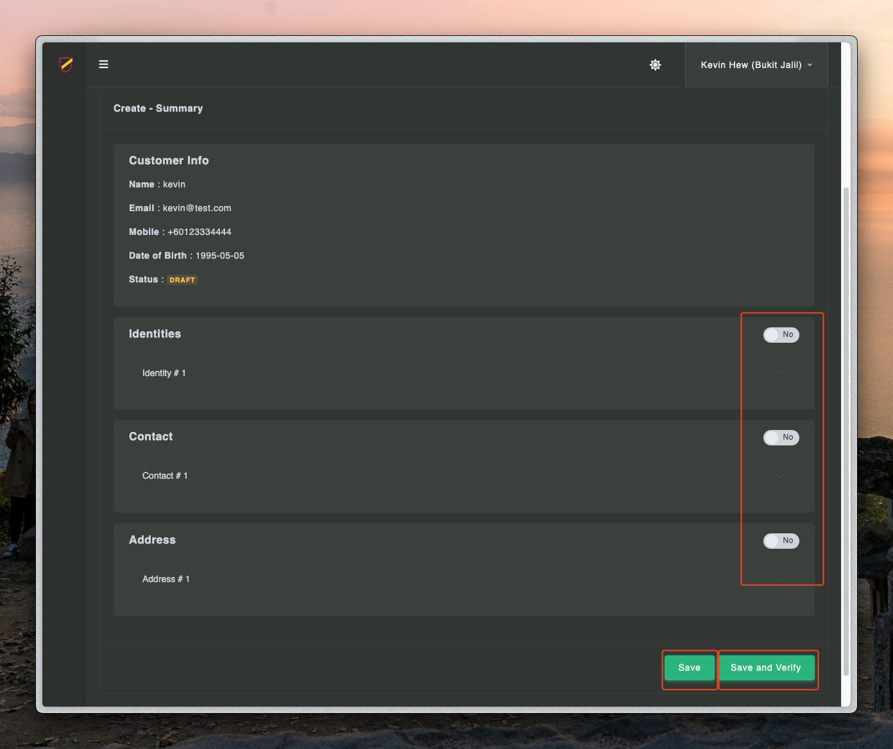

# Sale process - Step one

---

## Create client

1. First you need to login to teller.mmis.ounch.com with your username and password

2. Click client to navigate into the page

3. Click create client to create a new client

4. Fill in the details of client and proceed to the next step
- Name is required
- Gender is required
- Year is required
- Month is required
- Day is required
- Occupation is required
- Resident Address is required
- Postcode is required

5. Fill in the identity details and proceed to the next step

6. Fill in the contact details and proceed to the next step

6. Fill in the address details and proceed to the next step

7. Tick the button to confirm the details, save and verify to complete a client creation.

You have complete the first step !! 