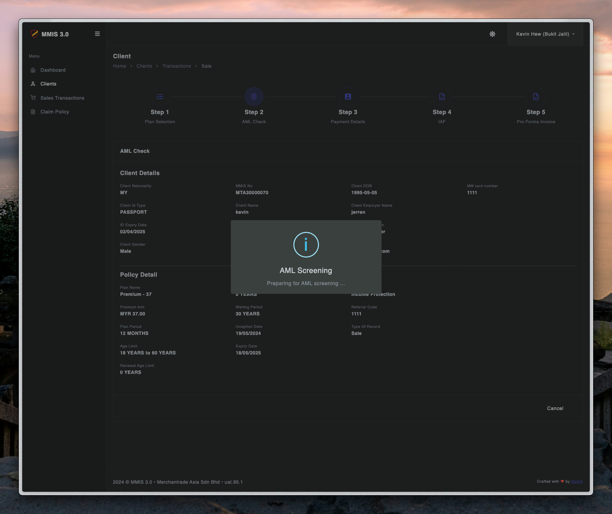
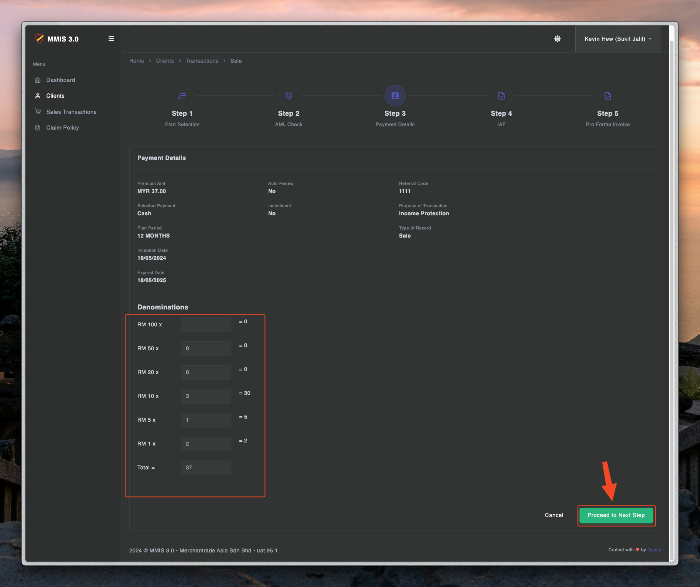
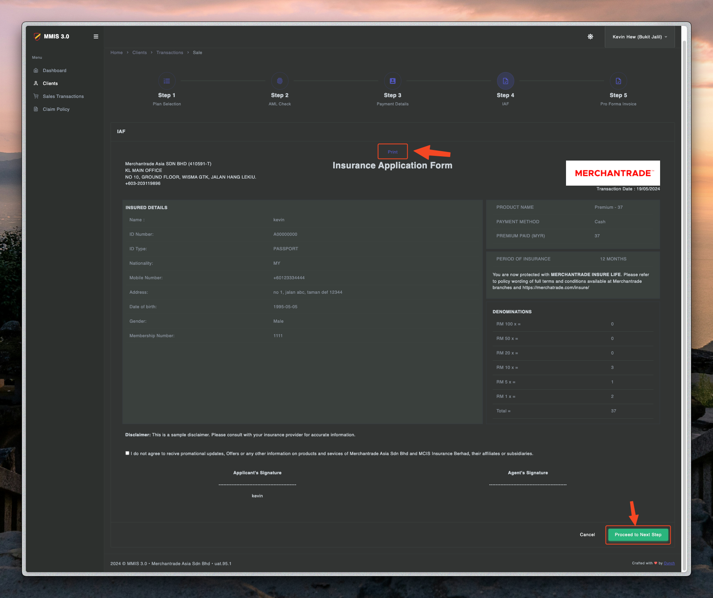
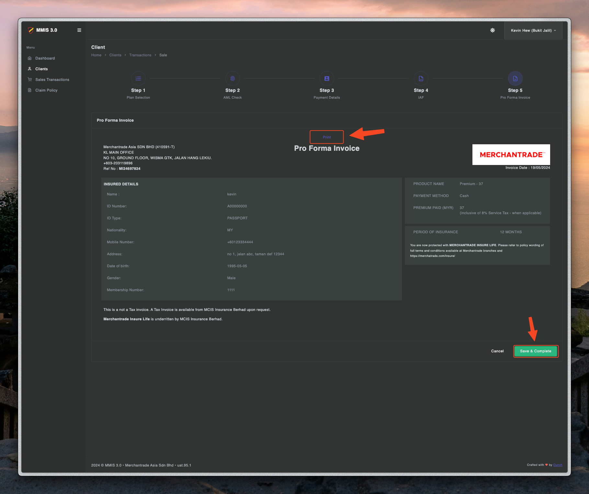

# Sale process - Step two

---

## Create transactions

1. Click client to navigate into the page.

2. Click transaction navigate into the page.

3. Click create transaction to create a new transaction.

4. Fill in the details of plan selections and proceed to the next step.

5. Wait for AML Checking for the identity.

6. Fill in the payment details.

7. Then LAF will create a form for you to print and proceed to the next step.

7. Last but not least, Pro Forma will create a form for you to print and save to complete the transactions.

