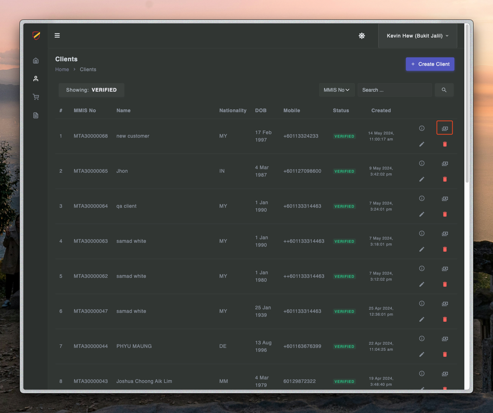
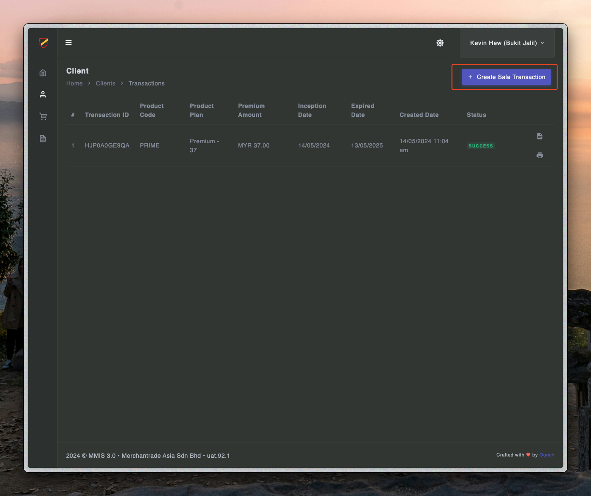
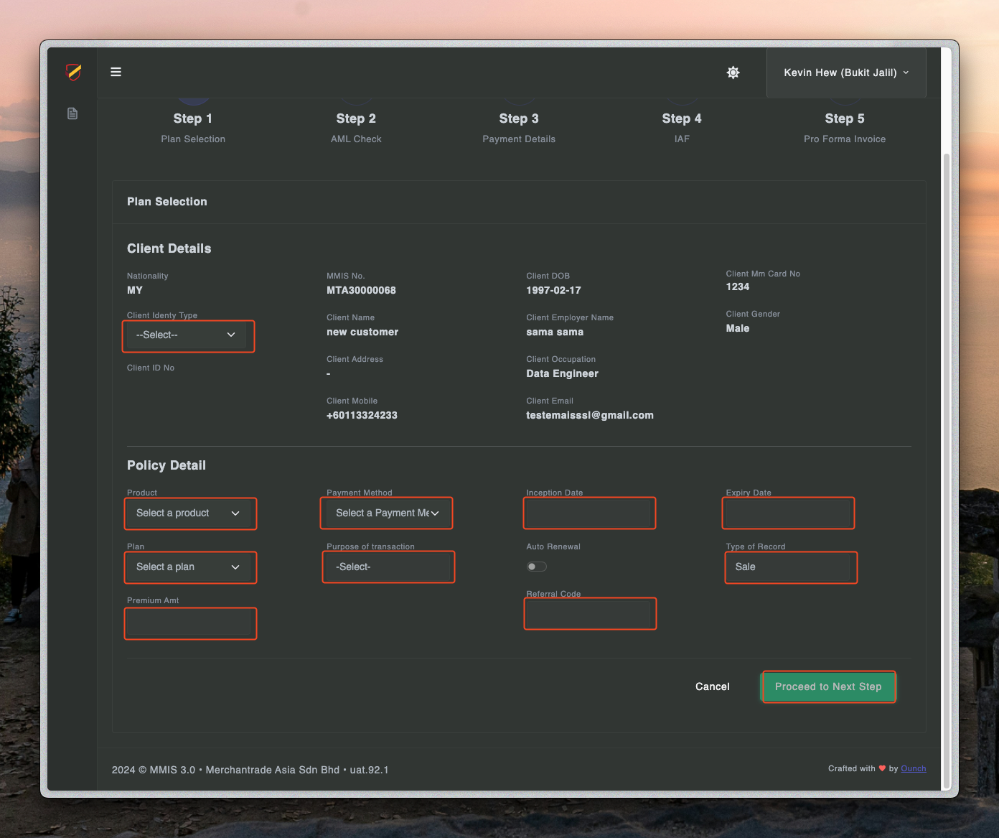

# Sale process - Step two

---

## Create transactions

1. Click client to navigate into the page

2. Click transaction navigate into the page

3. Click create transaction to create a new transaction

4. Fill in the details of plan selections and proceed to the next step

5. 