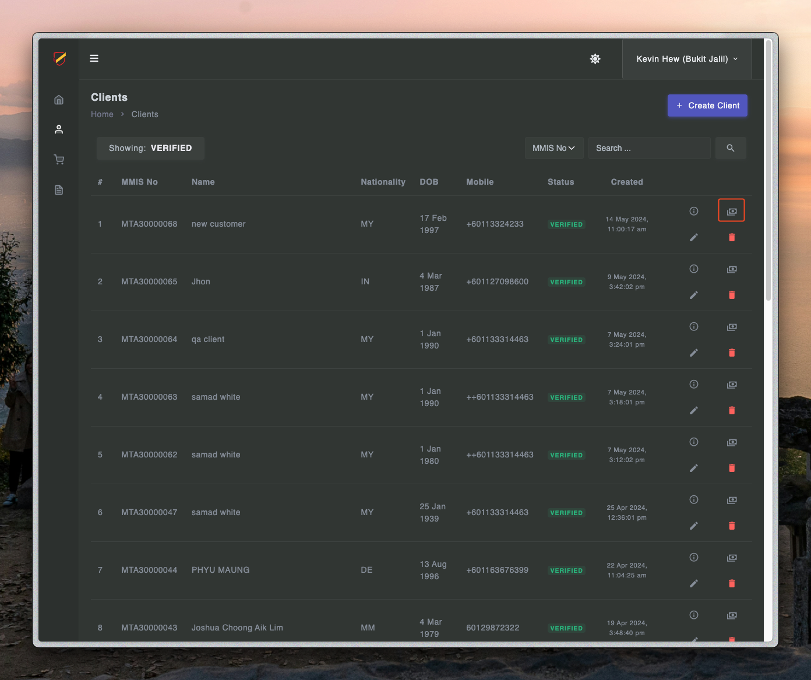

# Check transactions

### Check transactions

- Three way to check transactions

---

## Three way to check transactions

### I. Check it in individual client in teller

1. First you need to login to teller.mmis.ounch.com with your username and password.

2. Click client to navigate into the page.

3. Click transaction to navigate into the page.

4. Check the status in transaction.

### II. Check it in individual client in admin

1. First you need to login to admin.mmis.ounch.com with your username and password.

2. Click client to navigate into the page.

3. Click info to navigate into the page.

4. Click transactions to navigate into it and check the status.

 
 

### III. Check it in sale transactions in admin or teller

- Bear it mind only admin can check transaction in both admin and teller transactions.

1. First you need to login to admin or teller with your username and password.

2. Click client to navigate into the page.

3. Type in the Txn Ref No. and click search to see the results.

