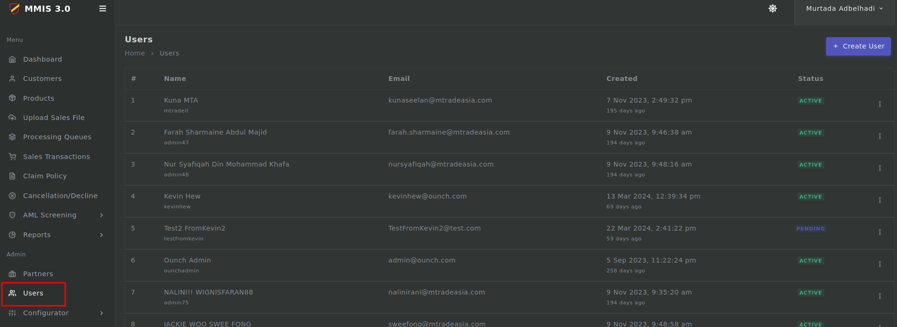
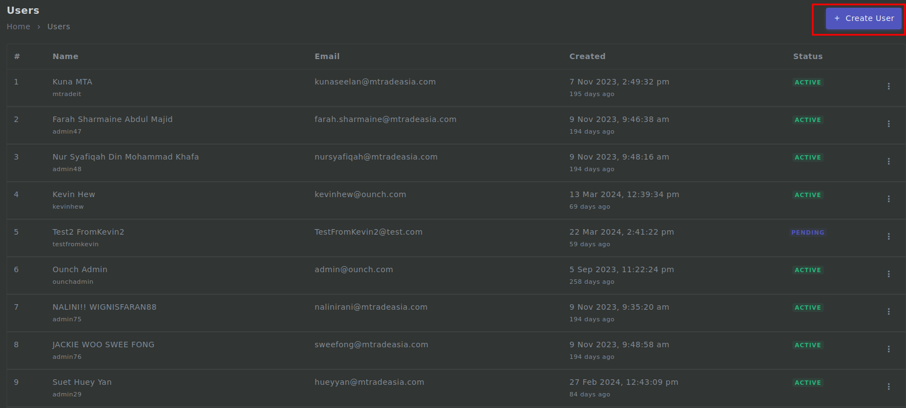
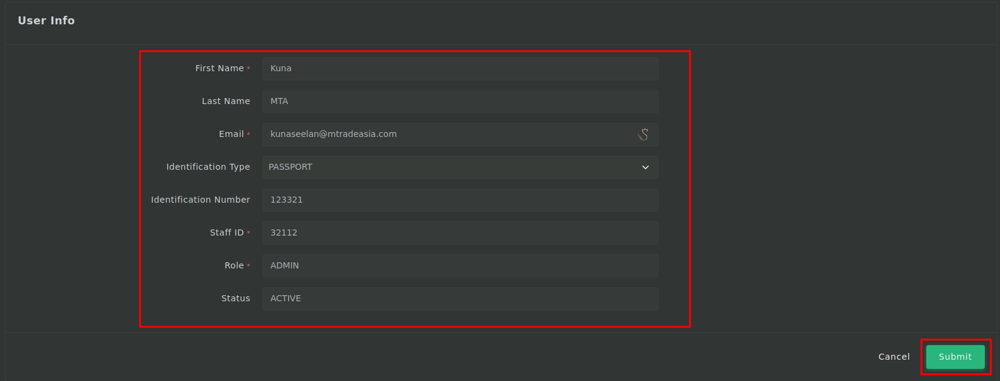

# User process

---

## Login

1. First you need to login to <mark>admin.mmis.ounch.com</mark> with your username and password.

2. Click on the **Users** link from the sidebar to navigate into the page. 

3. Then click on **Create User** to create a new user.

4. Fill in the required fields then click on **Submit**.
- First Name is required
- Last Name is required
- Email is required
- Identification Type is required
- Identification Number is required
- Staff ID is required
- Role is required
- Status is required

